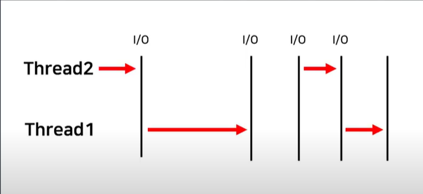

<h1>Python Multi Thread And GIL</h1>
<h2>1️⃣ 프로세스와 스레드</h2>
<h3>프로세스란</h3>

프로세스는 실행중인 프로그램

OS에서 CPU, 메모리 등의 자원을 할당받고 관리됨

   
<h3>스레드란</h3>
<h4>프로세스 내에서 작업 수행하는 실행단위</h4>
 

싱글 스레드는 15개의 작업을 직렬로 혼자 수행함

 

멀티 스레드는 15개의 작업을 병렬로 나누어 수행함

     
<h2>2️⃣ Python 멀티 스레드와 GIL</h2>
<h3>Python 멀티 스레드는 GIL로 인해 불가</h3>
<h4>Global Interpreter Lock</h4>

코드를 실행하는 인터프리터가 반드시 하나의 스레드만을 처리하도록 제한

   
<h3>GIL 활용</h3>
 
<h4>I/O 작업이 많을 경우</h4>
<h5>I/O 란</h5>

&nbsp; - 디스크가 파일을 읽고 쓸 때

&nbsp; - 네트워크 카드(NIC)가 송/수신할 때

<h5>와 같이 CPU가 아닌 다른 하드웨어에서 발생되는 연산</h5>
<h5>EX) Web, REST API 서버 </h5>
 
<h4>I/O 작업 발생 시, 스레드는 실행을 멈추고 해당 작업이 종료될 때까지 대기</h4>

     

<h2>3️⃣ Python에서 멀티 스레드 구현(멀티 프로세싱)</h2>
