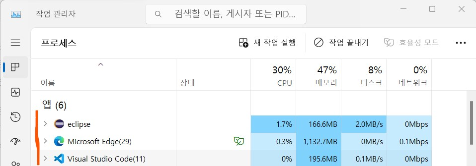
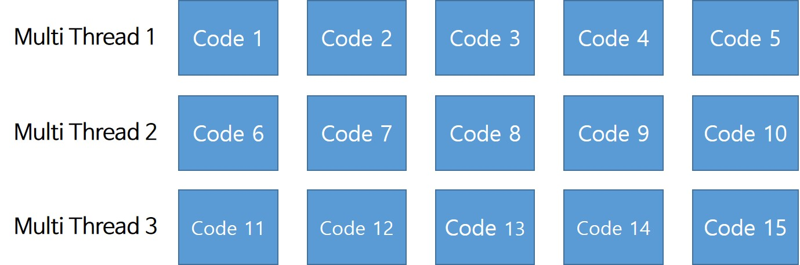

<h1>Python Multi Thread And GIL</h1>
<h2>1️⃣ 프로세스와 스레드</h2>
<h3>프로세스란</h3>

프로세스는 실행중인 프로그램

OS에서 CPU, 메모리 등의 자원을 할당받고 관리됨

   
<h3>스레드란</h3>
<h4>프로세스 내에서 작업 수행하는 실행단위</h4>
 

싱글 스레드는 15개의 작업을 직렬로 혼자 수행함

 

멀티 스레드는 15개의 작업을 병렬로 나누어 수행함

