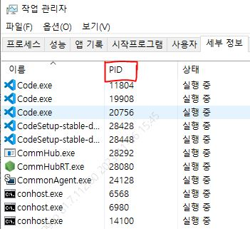
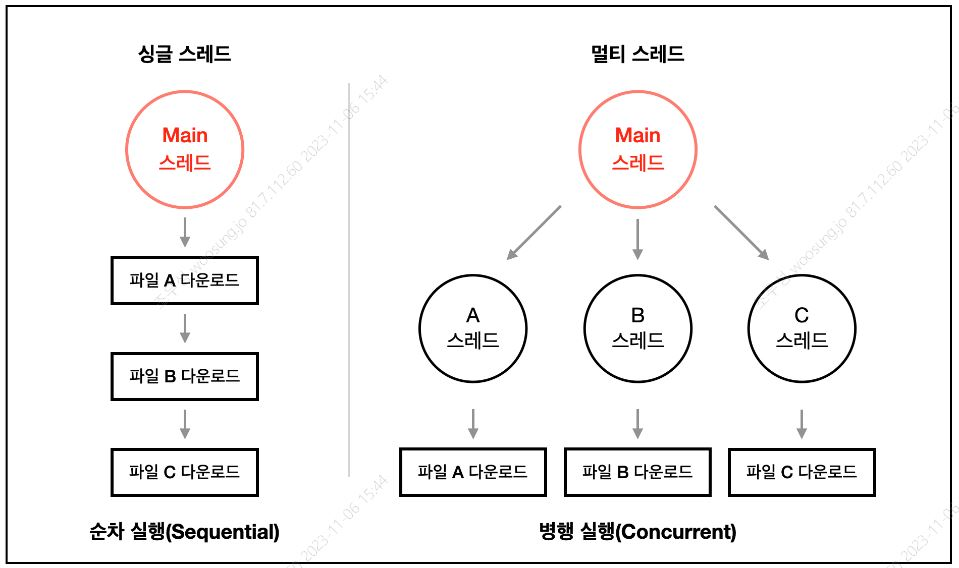
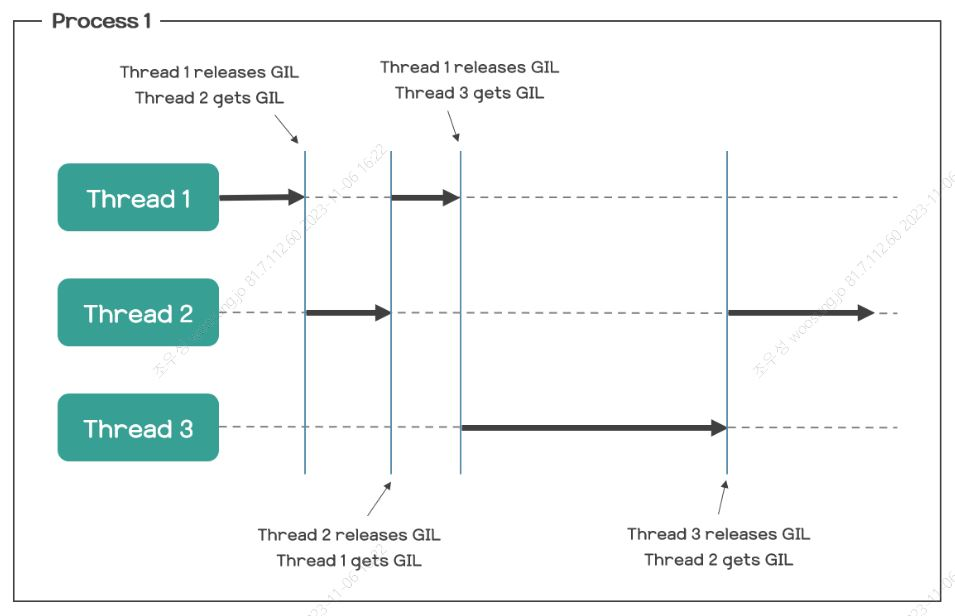

<h1>Python Multi Thread And GIL</h1>
<h2>1️⃣ 프로세스와 스레드</h2>
<h3>프로세스란</h3>
<h4>프로세스는 실행중인 프로그램</h4>
<p>OS에서 CPU, 메모리 등의 자원을 할당받고 관리됨</p>
<p>고유 PID를 가짐</p>

<br><br><br>
<h3>스레드란</h3>
<h4>프로세스 내에서 작업 수행하는 실행단위</h4>
<br>

<br><br><br><br><br>
<h2>2️⃣ Python 멀티 스레드와 GIL</h2>
<br>
<h3>Python 멀티 스레드 가능한가?</h3>
<h4>멀티 스레드는 ⭕, 병렬 실행은 ❌</h4>
<br><br><br>
<h3>예제</h3>
<br>
<h4>Python</h4>

```py
# Python 싱글 스레드

import time
from threading import Thread

def work(id, start, end, result):
    total = 0
    for i in range(start, end):
        total += i
    result.append(total)
    return

if __name__ == "__main__":

    start = time.time()

    result = list()
    th1 = Thread(target=work, args=(1, 0, 100000000, result))
    
    th1.start()
    th1.join()

print(f"Result: { sum(result) }")
print(f"Time: { time.time() - start }")
```

```py
# Python 멀티 스레드
import time
from threading import Thread

def work(id, start, end, result):
    total = 0
    for i in range(start, end):
        print(i)
        total += i
    result.append(total)
    return

if __name__ == "__main__":

    start = time.time()


    result = list()
    th1 = Thread(target=work, args=(1, 0, 50000000, result))
    th2 = Thread(target=work, args=(2, 50000000, 100000000, result))
    
    th1.start()
    th2.start()
    th1.join()
    th2.join()

print(f"Result: { sum(result) }")
print(f"Time: { time.time() - start }")

print(len(result))
```

<h4>Java</h4>

```java


public class Main {
	
	public static void main(String[] args) throws Exception {
		new Main();
	}
	
	public Main() {
		long startTime = System.currentTimeMillis();

		
//		TestThread th = new TestThread(0, 2000000000);
//		th.start();
//		while (th.isAlive()) {}
		
		TestThread th1 = new TestThread(0, 1000000000);
		TestThread th2 = new TestThread(1000000000, 2000000000);
		th1.start();
		th2.start();
		while (th1.isAlive() || th2.isAlive()) {}
		
		
		
		long time = System.currentTimeMillis() - startTime;
		System.out.println((double) time / 1000);
	}

	
	
	
	
	
	
	
	class TestThread extends Thread {

		private int start;
		private int end;

		public TestThread(int start, int end) {
			this.start = start;
			this.end = end;
		}

		@Override
		public void run() {
			long sum = 0;
			for (int i = start; i < end; i++) {
				sum += i;
			}
			System.out.println(sum);
			
		}
	}

}
```

<br><br><br><br><br>
<h3>GIL (Global Interpreter Lock)</h3>
<p>코드를 실행하는 인터프리터가 반드시 하나의 스레드만을 처리하도록 제한</p>

<br><br><br>
<h3>GIL 활용</h3>
<br>
<h4>I/O 작업이 많을 경우</h4>
<h5>I/O 란</h5>
<p>&nbsp; - 디스크가 파일을 읽고 쓸 때</p>
<p>&nbsp; - 네트워크 카드(NIC)가 송/수신할 때</p>
<h5>와 같이 CPU가 아닌 다른 하드웨어에서 발생되는 연산</h5>
<h5>EX) Web, REST API 서버 </h5>
<br>
<h4>I/O 작업 발생 시, 스레드는 실행을 멈추고 해당 작업이 종료될 때까지 대기</h4>

<br><br><br><br><br>

<h2>3️⃣ Python 병렬 작업</h2>
<br>
<h3>multiprocessing 모듈을 사용한 병렬 처리</h3>

```py
# 싱글 프로세스
import time
from multiprocessing import Process, Queue

def work(id, start, end, result):
    total = 0
    for i in range(start, end):
        total += i
    result.put(total)
    return

if __name__ == "__main__":
    start = time.time()
    
    START, END = 0, 100000000
    result = Queue()
    th1 = Process(target=work, args=(1, START, END, result))
    
    th1.start()
    
    th1.join()
    

    result.put('STOP')
    total = 0
    while True:
        tmp = result.get()
        if tmp == 'STOP':
            break
        else:
            total += tmp

    print(f"Result: {total}")
    print(f"Time: { time.time() - start }")
```

```py
# 멀티 프로세스
import time
from multiprocessing import Process, Queue

def work(id, start, end, result):
    total = 0
    for i in range(start, end):
        total += i
    result.put(total)
    return

if __name__ == "__main__":
    start = time.time()
    
    START, END = 0, 100000000
    result = Queue()
    th1 = Process(target=work, args=(1, START, END//2, result))
    th2 = Process(target=work, args=(2, END//2, END, result))
    
    th1.start()
    th2.start()
    th1.join()
    th2.join()

    result.put('STOP')
    total = 0
    while True:
        tmp = result.get()
        if tmp == 'STOP':
            break
        else:
            total += tmp

    print(f"Result: {total}")
    print(f"Time: { time.time() - start }")
```

<br><br><br><br><br>
<h2>4️⃣ 결론</h2>
<h4>Python은 반드시 하나의 스레드만 처리해야 하기에 멀티 스레드를 만들어도, 병렬 처리가 불가하다.</h4>
<h4>Python으로 병렬 처리가 필요할 시, 멀티 프로세싱으로 구현 가능하다.</h4>
